- [Keys](#keys)
- [Relacions](#relacions)
  - [N:M](#nm)
  - [1:1](#11)
  - [1:1 +1RE](#11-1re)
  - [1:1 +2RE](#11-2re)
  - [1:N](#1n)
  - [1:N +1RE](#1n-1re)
  - [Generalització](#generalització)
  - [Reflexives](#reflexives)
    - [1:1](#11-1)
    - [1:N](#1n-1)
    - [N:M](#nm-1)
  - [Ternaries](#ternaries)
    - [M:M:M](#mmm)
    - [M:M:1](#mm1)
    - [M:1:1](#m11)
    - [1:1:1](#111)
  - [Agregació](#agregació)
    - [M:M - 1:1](#mm---11)
    - [M:M - M:1](#mm---m1)
    - [1:M - M:1](#1m---m1)
    - [1:M - M:M](#1m---mm)
# Keys

- PK (Primary Key)
- UK (Unique Key)
- FK (Foreign Key)
 
# Relacions

- N:M
- 1:1
- 1:1 +1RE
- 1:1 +2RE
- 1:N
- 1:N +1RE
- Generalització
- x3 Reflexives
- x4 Ternaries
- x4 Agregació

## N:M
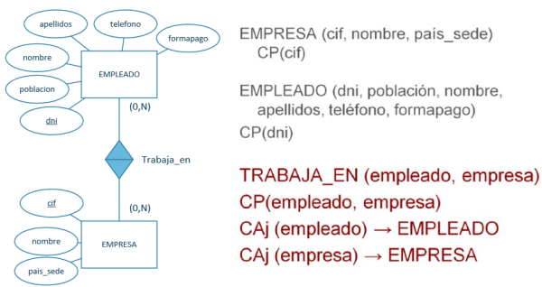

## 1:1
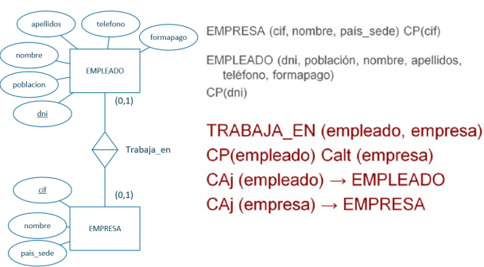

## 1:1 +1RE
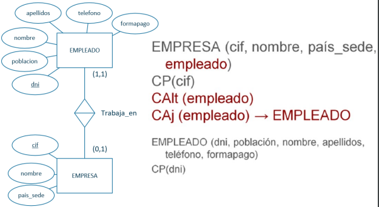

## 1:1 +2RE
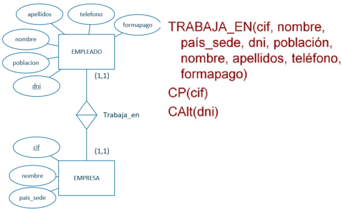

## 1:N
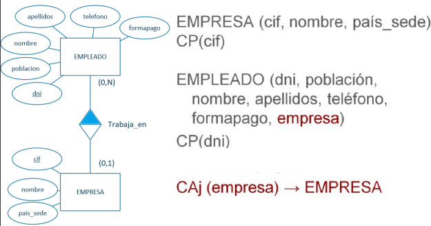

## 1:N +1RE
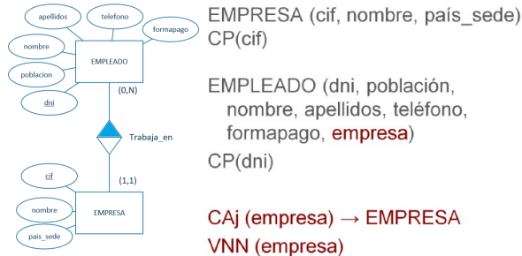

## Generalització
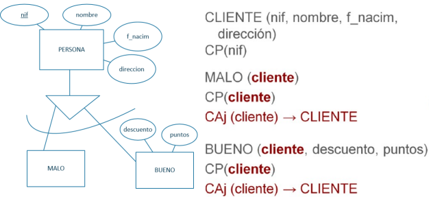

## Reflexives
### 1:1
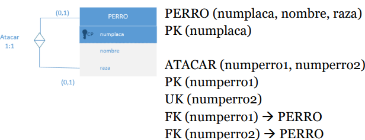

### 1:N
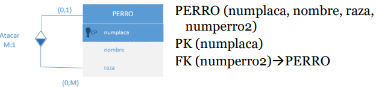

### N:M
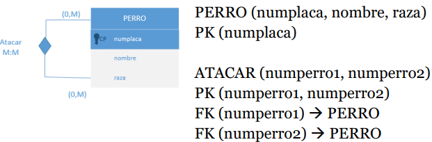

## Ternaries
### M:M:M
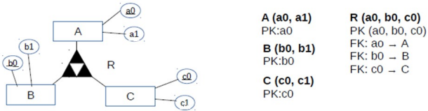

### M:M:1
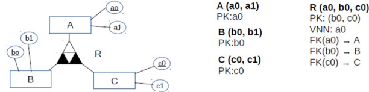

### M:1:1
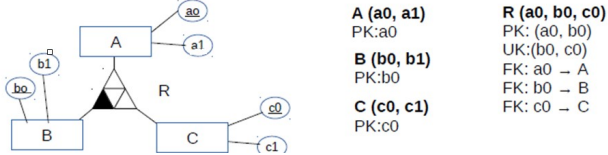

### 1:1:1
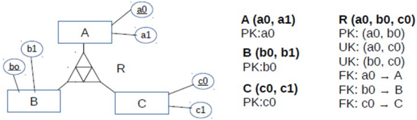

## Agregació
### M:M - 1:1
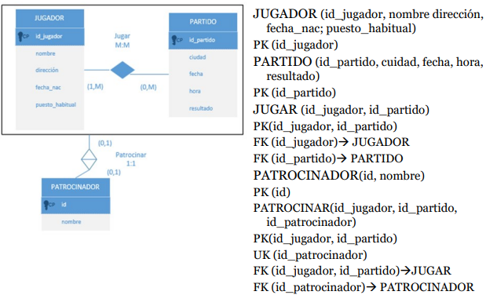

### M:M - M:1
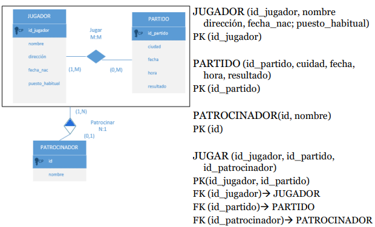

### 1:M - M:1
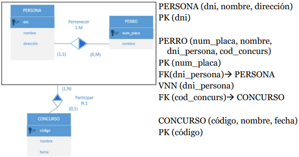

### 1:M - M:M
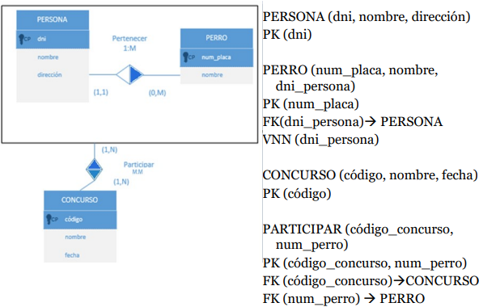